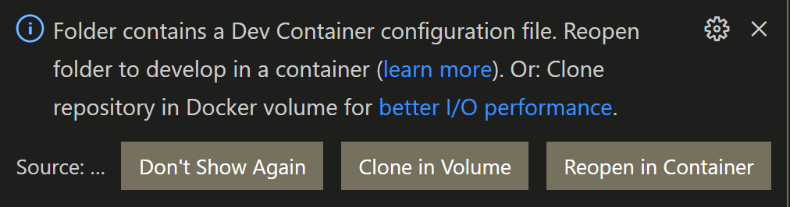
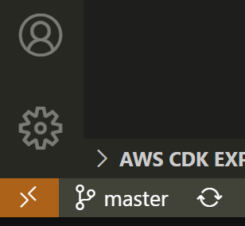

# Nodejs Express Template

Small template for Node and Express backed up by a Postgresql DB, all within a Vscode devcontainer  

Should work under Linux, Windows 10 (19.09 and higher) with WSL2, MacOSX (either Intel or Apple Silicon)  

## How to use  

### Requirements  

* For Windows 10 (19.09 and higher): [WSL2](https://docs.microsoft.com/de-de/windows/wsl/install-win10)
* Docker (Desktop): [Ubuntu](https://docs.docker.com/engine/install/ubuntu/), [Windows 10](https://docs.docker.com/docker-for-windows/install/), [MacOSX (both Intel and Apple Silicon)](https://docs.docker.com/docker-for-mac/install/)  
* [Docker Compose](https://docs.docker.com/compose/install/)  
* [Visual Studio Code](https://code.visualstudio.com/download) (you can also choose to install it via apt/chocolatey/homebrew)  

### Steps  

* Start Vscode and install required extension for devcontainers. [Linux & Mac: Remote Containers](https://marketplace.visualstudio.com/items?itemName=ms-vscode-remote.remote-containers) / [Windows 10: Remote Development Extensionpack](https://marketplace.visualstudio.com/items?itemName=ms-vscode-remote.vscode-remote-extensionpack)  
* Clone this repo: *"git clone https://gitlab.com/thetom42/node-restserver.git"*  
* *"cd nodejs-express-template"*  
* *"code ."*  
*   Either click on "Reopen in Container" in popup window on the bottom left:   
*   or click on remote "Quick Access" status bar item in the lower left corner and then choose "Open in Container" from the menu:  
  
The source code is based on an arcticle series by Robin Wieruch: [Setup PostgreSQL with Sequelize in Express](https://www.robinwieruch.de/postgres-express-setup-tutorial/)  
  
That's it. Enjoy!  
